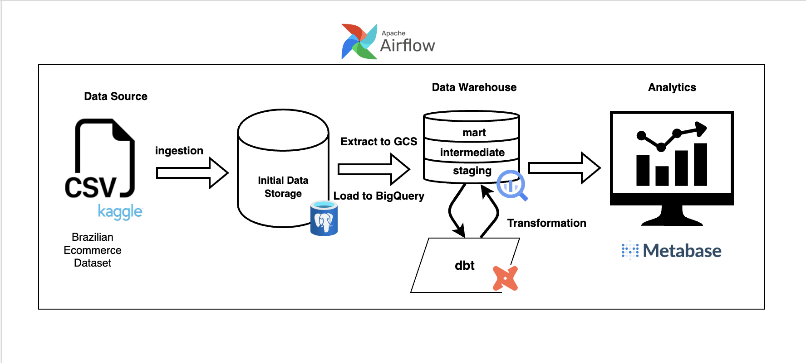
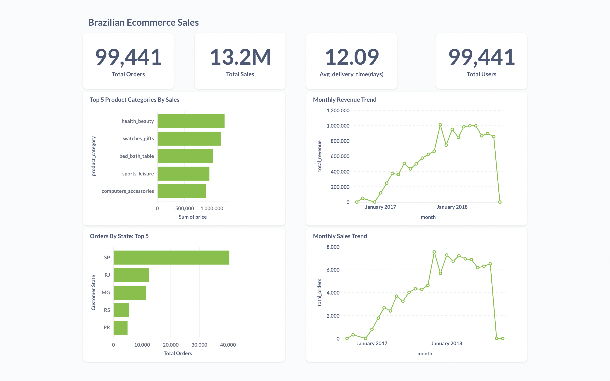

# ETL Pipeline Documentation

## Project Overview

This project demonstrates an end-to-end ETL pipeline using the Brazilian E-Commerce Dataset from Kaggle. The goal is to ingest raw data into PostgreSQL, process and transform it using Airflow and dbt, and store the final results in BigQuery for analytical purposes.

## Project Architecture
The architecture consists of:

- Data Source: Brazilian e-commerce dataset (CSV files)

- Data Storage: PostgreSQL as the staging database

- Orchestration: Apache Airflow to automate the ETL workflow

- Data Warehousing: Google BigQuery

- Transformation: dbt (Data Build Tool) for modeling

- Visualization: Metabase for dashboarding



## Detailed Component Analysis

**PostgreSQL Setup**

- Database: PostgreSQL (Dockerized)

- Tables Created: Customer, Orders, Order Items, Payments, Geolocation, etc.

- Data Ingestion: Airflow DAG loads CSV data into PostgreSQL

Issues Faced: Geolocation dataset had over 1 million rows, causing ingestion challenges

**Airflow Workflow**
- DAG Structure:
  - extract_postgres: Pulls data from PostgreSQL.
  - load_bigquery: Transfers data to BigQuery.
- Error Handling & Monitoring:
  - Retries configured for transient failures.
  - Logs stored in Airflow UI and centralized monitoring tool.
- Data Movement (PostgreSQL to BigQuery)
  - Airflow PostgreSQL-to-GCS, then GCS-to-BigQuery.

**dbt Transformation Layer**
- Structure: Staging, Intermediate, and Marts layers
- Tests Implemented: Ensured unique id fields, non-null constraints
- Performance Considerations: Optimized SQL transformations

**BigQuery Implementation**
- Dataset and Table Design:
  - staging: Raw imported data
  - marts: Final tables for analytics
- Optimization: No partitioning or clustering implemented

**Visualization with Metabase**
**Insights**



## How to Run the Project
**Prerequisites**
- Docker & Docker Compose
- Google Cloud SDK with BigQuery access
- dbt installed

Step-by-Step Setup

1. Clone the Repository
```bash
git clone <repo-url>
cd project-directory
```

2. Fire Up Docker Containers
```bash
docker-compose up -d
``` 

3. Ingest Data into PostgreSQL by triggering the `data_ingestion` DAG on the airflow webserver UI. You can access it by navigating to http:/localhost:8080 in your browser.

4. Transfer Data to BigQuery
Ensure your GCP credentials are set up, then trigger the rest of the DAGs from the Airflow web UI to start the data transfer to BigQuery process.

5. Run dbt Transformations
```bash
dbt run 
dbt test 
```

6. Set Up Metabase
Access Metabase at http://localhost:3000 and configure the BigQuery connection.

## Lessons Learned
This project was an eye-opener in many ways.

**Orchestration is More Than Just Running Tasks:** First, working with Airflow tested my patience. Debugging DAG failures—especially silent ones—was frustrating but rewarding when I finally got everything running smoothly. I learned to check logs meticulously and not just rely on UI-based error messages.

**Dealing with Large Datasets is Tricky:** I hit a roadblock when trying to ingest the geolocation dataset into PostgreSQL because it had over a million rows. It made me realize that blindly loading data without thinking about performance can be a nightmare. Next time, I’d explore partitioning, indexing, or even alternative storage formats like Parquet to improve performance.

**dbt is a Game-Changer for Data Transformations:** Before this project, I hadn’t fully grasped why dbt is so popular. Now, I see the beauty in modular transformations, clear model dependencies, and automated testing. Writing SQL in a structured, scalable way is a game-changer.

**Visualization is the Final Mile:** Building the dashboard in Metabase made me appreciate how important it is to structure data properly for end users. Raw data alone means nothing until it’s turned into insights people can understand. Simplicity is key—too many metrics can overwhelm users instead of helping them make decisions.

**Documentation Matters:** I’ll be honest, writing documentation felt like an afterthought at first. But looking back, having clear, step-by-step documentation makes this project reusable for anyone (including my future self!).

Overall, this project reinforced my problem-solving skills, patience, and ability to adapt to different tools. Next time, I’d plan error-handling mechanisms upfront instead of treating them as an afterthought. But most importantly, I’ve realized that no data pipeline is truly “done”—there’s always room for improvement!

Feel free to reach out if you have any questions or just want to connect! 
- [LinkedIn](https://www.linkedin.com/in/blessingangus/)

